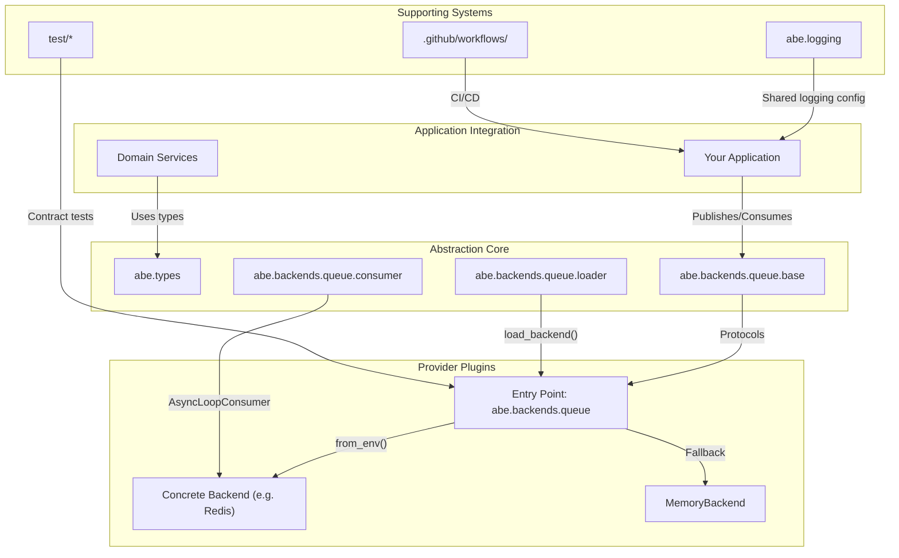

# Abstract Backend Architecture Overview

Abstract Backend offers a pluggable backend layer that lets applications target stable Python protocols while discovering concrete implementations at runtime. This page explains the major components, how they collaborate, and which supporting systems keep the abstraction reliable.

## Section map

- **Architecture Overview** (this page) – High-level map of the abstraction core, provider plugins, and supporting infrastructure.
- **Runtime Flow** – Sequence diagrams describing discovery, publish/consume loops, and deployment considerations.
- **Provider Lifecycle** – Checklist for creating, testing, and distributing new backends.
- **Project Structure** – Reference for repository layout and supporting assets.

## Layered design

- **Application Integration**: Your services import `QueueBackend`, `AsyncLoopConsumer`, and shared type aliases, remaining agnostic to concrete providers.
- **Abstraction Core**: Modules under `abe/backends/queue/` define the protocols and discovery code that mediate between applications and providers.
- **Provider Plugins**: External packages register entry points that implement the contracts and can be swapped at runtime.
- **Supporting Systems**: Logging utilities, contract tests, and CI workflows reinforce the guarantees promised by the abstraction.

## Core modules

- **`abe/types.py`** defines the structural contracts (`QueueBackendProtocol`, `EventHandlerProtocol`, JSON aliases) distributed via `py.typed`.
- **`abe/backends/queue/base/`** exports `QueueBackend` and `EventConsumer` protocols, capturing publish/consume semantics and consumer lifecycle.
- **`abe/backends/queue/loader.py`** discovers provider entry points via `importlib.metadata`, applies environment-based selection rules, and falls back to `MemoryBackend` when nothing is installed.
- **`abe/backends/queue/consumer.py`** bundles runtime helpers (`AsyncLoopConsumer`) to execute handlers against any compliant backend.
- **`abe/backends/queue/service/memory.py`** provides the built-in development backend.

See the [API Reference](../../document/api-references/api-references.mdx) for method-level detail.

## Runtime flow

The typical request lifecycle:

1. **Provider selection** – `load_backend()` inspects the `abe.backends.queue` entry-point group, honours `QUEUE_BACKEND`, and instantiates the chosen class through `from_env()`.
2. **Publishing events** – Application code calls `backend.publish(key, payload)` using `QueueKey`/`QueuePayload` aliases to ensure consistent typing.
3. **Consuming events** – `AsyncLoopConsumer` wraps `backend.consume(group=...)`, executing the application’s handler coroutine. Cancellation and error handling are standardised here.
4. **Observability** – `abe.logging.utils` can standardise log formatting and levels across providers and consumers.

Detailed sequence diagrams live in [Runtime Flow](./runtime-flow.mdx).

## Provider lifecycle

Abstract Backend promotes a clean separation between the core abstraction and provider implementations:

1. **Implement protocols** – Providers subclass nothing; they simply satisfy `QueueBackendProtocol` and expose `from_env()`.
2. **Register entry points** – `pyproject.toml` declares the provider under `abe.backends.queue` so `load_backend()` can find it.
3. **Package distribution** – Providers are published as normal Python packages, allowing teams to install or uninstall them with `pip`.
4. **Validation** – Tests under `test/contract_test/backends/queue/` assert new providers honour the contract.

See [Provider Lifecycle](./provider-lifecycle.mdx) for an end-to-end checklist.

## Supporting infrastructure

- **Testing**: Contract, unit, integration, and e2e suites located under `test/` validate both the abstraction and reference implementations. Scripts in `scripts/ci/` orchestrate type-check and verification runs.
- **CI/CD**: Workflows in `.github/workflows/` run tests across multiple Python versions, ensure type distribution (PEP 561), and publish releases.
- **Documentation**: This Docusaurus site (`docs/contents/`) and `docs/LOGGING.md` document runtime features for both consumers and provider authors.

## Design principles

- **Protocol-first** – All core contracts are structural type protocols exported from `abe/types.py`, ensuring consumers compile against the same surface.
- **Runtime pluggability** – Providers are discovered via Python entry points; swapping implementations does not require code changes.
- **Typed ergonomics** – The project distributes `py.typed` so editors and CI keep abstractions honest.
- **Operational clarity** – Logging helpers (`abe/logging/utils.py`) and contract tests ensure behaviour stays observable and portable.

## Related guides

- **Structure & Files** → [Project Structure](./project-structure.mdx)
- **Runtime flow** → [Runtime Flow](./runtime-flow.mdx)
- **Provider lifecycle** → [Provider Lifecycle](./provider-lifecycle.mdx)
- **Type system** → [Type Checking with MyPy](../type-checking.mdx)
