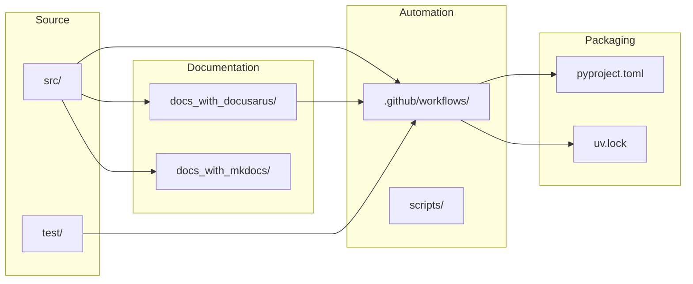

# Template Architecture Overview

This page explains how the Python UV Project Template is organized and how the main building blocks (source code, automation, and documentation) work together. Use it as a map when adapting the template to your own project.

## Architecture Pillars

- **Application Layer (`src/`)** – Houses your Python package using the modern src-layout.
- **Quality & Testing (`test/`, `pre-commit`)** – Provides pytest-based suites, coverage reporting, linting, and type-checking tooling configured through uv.
- **Automation (`.github/workflows/`)** – Collection of GitHub Actions for CI, releases, docs, Docker, and supporting tasks.
- **Documentation (`docs_with_docusarus/`, `docs_with_mkdocs/`)** – Docusaurus (primary) and MkDocs (optional) documentation systems ready for customization.

## Repository Topology

## What Lives Where?

- **`src/`** – Your distributable package, including the default `types.py` example and `py.typed` marker for PEP 561 compliance.
- **`test/`** – Unit and integration test scaffolding with pytest plugins preconfigured in `pyproject.toml`.
- **`.github/workflows/`** – Automation entry points (CI, release, documentation, Docker, type distribution, etc.).
- **`docs_with_docusarus/`** – Primary documentation site (this guide). Includes reusable content, versioning, and search configuration.
- **`docs_with_mkdocs/`** – Alternate documentation stack if your team prefers MkDocs.
- **`scripts/`** – Helper scripts invoked by workflows for packaging, docs, and build orchestration.
- **`pyproject.toml` / `uv.lock`** – Single source of truth for dependencies, tool configuration, and packaging metadata.

## How the Pieces Work Together

1. **Develop locally with uv** – Use `uv sync` to install dependencies defined in `pyproject.toml` and locked in `uv.lock`.
2. **Validate with pre-commit** – Preconfigured hooks (formatting, linting, type checking) keep commits consistent.
3. **Run CI** – `ci.yaml` (regular) and `ci_includes_e2e_test.yaml` (extended) execute the same matrix of tests GitHub-side.
4. **Ship releases** – Intent-driven workflows publish Python packages, container images, and docs from a single configuration file.
5. **Publish docs** – Docusaurus builds run automatically after releases or documentation-only pull requests.

## Related Guides

- **Structure & Files** → [Project Structure](./project-structure.mdx)
- **CI/CD System** → [CI/CD Overview](../ci-cd/index.mdx)
- **Type Checking** → [Type Checking with MyPy](../type-checking.mdx)

Use these pages to drill into specific subsystems once you customize the template for your own project.
