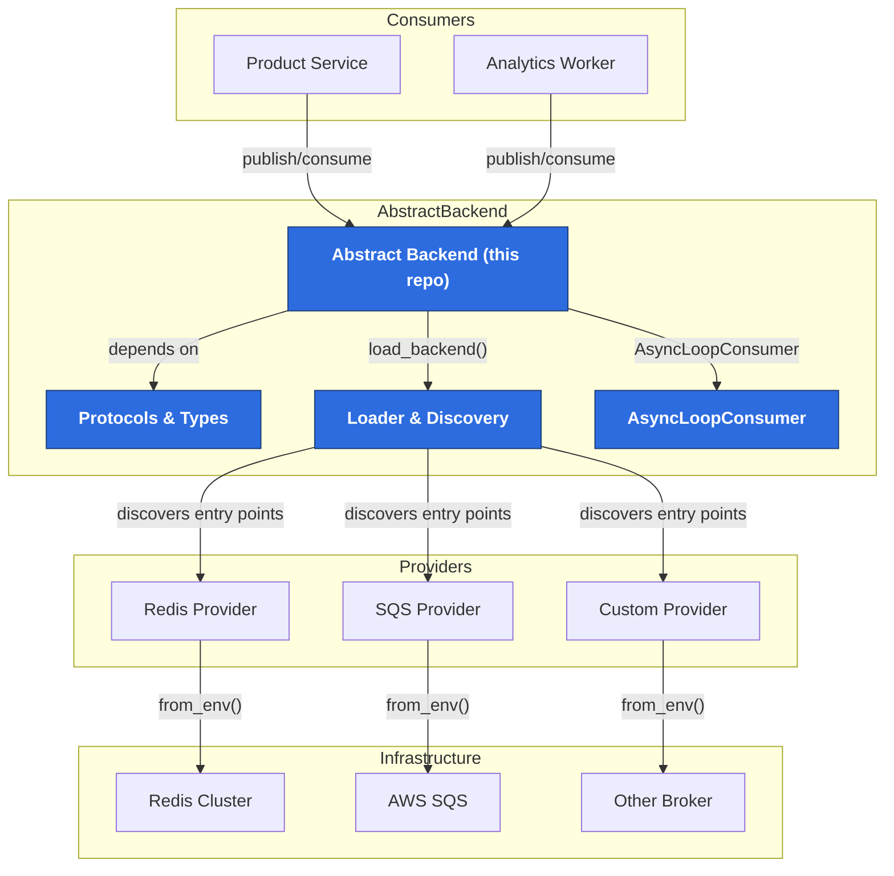

# Abstract Layer vs. Provider Projects

This page explains how the Abstract Backend library coordinates with provider repositories that deliver concrete queue implementations. Use it to visualise hand-offs between the shared abstraction, provider code, and consuming applications.

## System view

## Responsibilities

- **Abstract Backend (`Core`, `Types`, `Loader`, `Consumer`)** – Defines stable protocols, discovery mechanisms, and runtime helpers. Ships in this repository.
- **Provider projects (`Redis`, `SQS`, `Custom`)** – Independent packages that implement the protocols and register entry points. They own connection logic to their infrastructure.
- **Infrastructure (`Redis Cluster`, `AWS SQS`, etc.)** – External services the providers interact with.
- **Consumers (your applications)** – Import the abstract layer, select providers via environment variables, and use shared helpers to publish/consume events.

## Collaboration workflow

1. **Install** – Applications install `abstract-backend` plus the desired provider package(s).
2. **Configure** – Set `QUEUE_BACKEND` and provider-specific environment variables so `load_backend()` picks the correct implementation.
3. **Compose** – Use abstractions like `AsyncLoopConsumer` to wire application handlers without referencing provider-specific APIs.
4. **Extend** – Provider teams release updates independently; applications upgrade when ready without changing business logic.
5. **Monitor** – Logging utilities (`abe/logging/utils.py`) give consistent visibility across providers.

This layered approach keeps application code stable while allowing backend capabilities to evolve via separate provider repositories.
