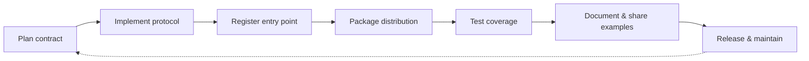

# Provider Lifecycle

Follow this checklist when building and maintaining a backend provider for Abstract Backend. The workflow ensures your implementation plugs into the abstraction safely and remains easy to install, test, and deprecate.



## 1. Plan the contract

- **Choose identifiers**: Decide on the entry-point name (e.g. `redis`, `sqs`).
- **Map configuration**: List environment variables and connection details that `from_env()` must read.
- **Confirm message semantics**: Align on what your `QueueMessage` will contain beyond the payload (metadata, IDs, timestamps).

## 2. Implement the protocol

```python
from typing import AsyncIterator

from abe.types import (
    QueueBackendProtocol,
    QueueKey,
    QueuePayload,
    QueueMessage,
    ConsumerGroup,
)


class RedisBackend(QueueBackendProtocol):
    @classmethod
    def from_env(cls) -> "RedisBackend":
        ...

    async def publish(self, key: QueueKey, payload: QueuePayload) -> None:
        ...

    async def consume(
        self,
        *,
        group: ConsumerGroup = None,
    ) -> AsyncIterator[QueueMessage]:
        ...
```

- Respect cancellation inside `consume()` and clean up connections when the iterator ends.
- Raise informative exceptions from `publish()` so callers can handle retry logic.

## 3. Register entry points

Add registration to `pyproject.toml` so `load_backend()` can discover the provider:

```toml
[project.entry-points."abe.backends.queue"]
redis = "abe_backend_redis.backend:RedisBackend"
```

If you publish multiple backends in one distribution, register each under a unique name.

## 4. Package distribution

- Publish wheels/sdists to your chosen index (PyPI or private registry).
- Include `py.typed` if you expose additional types or protocols.
- Document installation commands (`pip install abe-backend-redis`) so users know how to activate the provider.

## 5. Test coverage

- **Unit tests**: Validate `publish()`/`consume()` behavior in isolation.
- **Integration tests**: Spin up the target service (e.g. Redis, SQS) and exercise end-to-end flows using your preferred infrastructure tooling.
- **Contract tests**: Reuse the project’s suites under `test/contract_test/backends/queue/` to confirm protocol compliance.

## 6. Documentation & examples

- Write usage notes covering required environment variables and sample configuration.
- Provide minimal producer/consumer snippets to help adopters verify installation.
- Link back to the main [Runtime Flow](./runtime-flow.mdx) guide so users can see where your provider fits.

## 7. Release & maintenance

- Version providers semantically (`1.2.0` etc.) and publish release notes about breaking changes.
- Automate CI to run contract tests before publishing.
- Deprecate providers by updating documentation and raising explicit runtime warnings before removal.

Sticking to this lifecycle keeps the Abstract Backend ecosystem predictable and maintains drop-in compatibility across providers.
