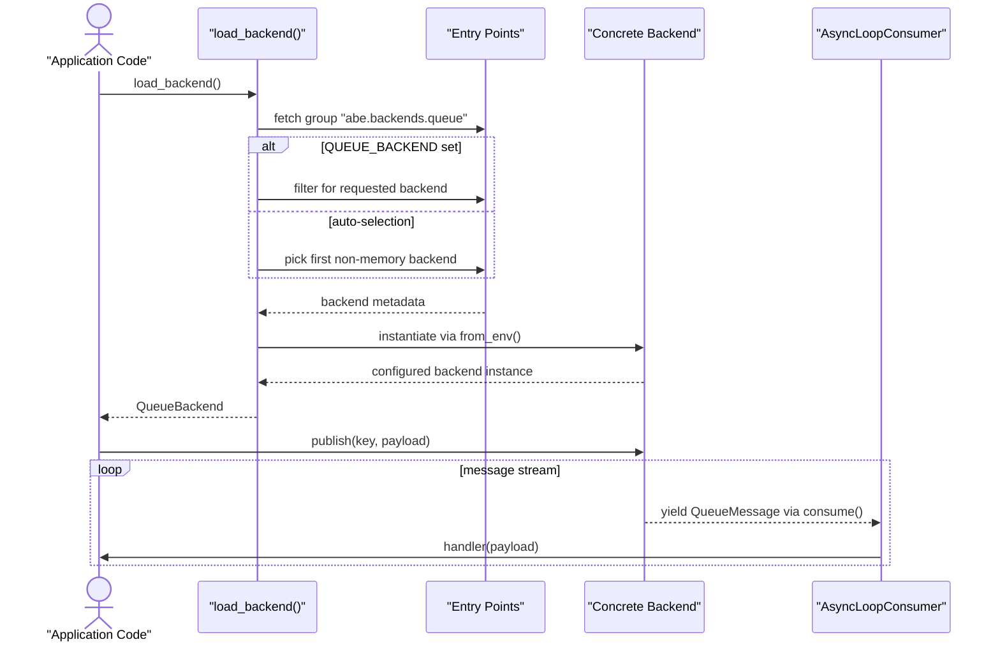
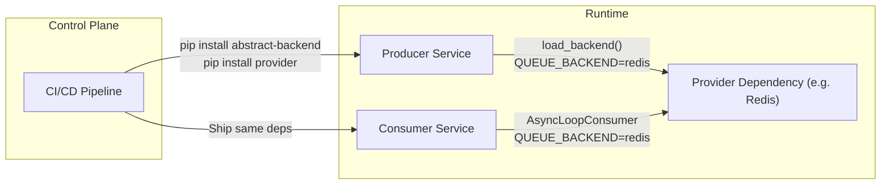

# Runtime Flow

This page walks through how Abstract Backend resolves providers, publishes events, and drives consumers. Use it to understand the runtime responsibilities shared between the abstraction core and provider packages.

## High-level sequence



## Detailed phases

### 1. Provider discovery

- `load_backend()` in `abe/backends/queue/loader.py` reads the `abe.backends.queue` entry-point group via `importlib.metadata.entry_points()`.
- If `QUEUE_BACKEND` is set, it looks up the matching entry-point name and loads that implementation.
- Without an override, it returns the first non-memory backend; if none exist, it falls back to `MemoryBackend` (and warns).
- The loaded provider must expose `from_env()` to construct itself from environment configuration.

### 2. Publishing events

- Application code calls `backend.publish(key, payload)` where `key` is a `QueueKey` and `payload` is a `QueuePayload` (both from `abe/types.py`).
- Providers are responsible for serialization, routing, and error propagation. Errors should surface as rich exceptions so callers can retry or alert.

### 3. Consuming events

- `AsyncLoopConsumer` wraps `backend.consume(group=...)` in an asyncio task.
- Each yielded `QueueMessage` is passed to your handler coroutine. The helper logs unexpected exceptions but keeps the loop alive unless a fatal error occurs.
- `shutdown()` cancels the consumption task and ensures queues acknowledge in-flight messages when possible.

### 4. Observability and resilience

- `abe/logging/utils.py` provides utilities (`LoggingConfig`, `setup_logging_from_config()`) to align logs across providers and consumers.
- Providers should integrate with these helpers when emitting their own logs for consistent formatting.
- Contract tests under `test/contract_test/backends/queue/` assert that new implementations honour cancellation handling and message semantics.
## Deployment considerations


- Deploy producers and consumers with the same provider packages installed so `load_backend()` resolves consistently.
- Inject `QUEUE_BACKEND` (and provider-specific variables) through your configuration system to avoid hard-coded choices.

```python title="app/bootstrap.py"
from abe.backends.queue.loader import load_backend
from abe.backends.queue.consumer import AsyncLoopConsumer
from abe.logging.utils import setup_logging_from_config, LoggingConfig


def configure_logging() -> None:
    config = LoggingConfig(level="INFO", logger_levels={"myapp.db": "WARNING"})
    setup_logging_from_config(config)


async def create_consumer(handler):
    backend = load_backend()
    consumer = AsyncLoopConsumer(backend, group="billing")
    await consumer.run(handler)


async def publish_event(key: str, payload: dict[str, object]) -> None:
    backend = load_backend()
    await backend.publish(key, payload)
```

This pattern keeps logging, provider selection, and event processing aligned across services.


## Related docs

- [Provider Lifecycle](./provider-lifecycle.mdx)
- [QueueBackend protocol reference](/docs/next/api-references/queue-backend)
- [AsyncLoopConsumer reference](/docs/next/api-references/event-consumer)
