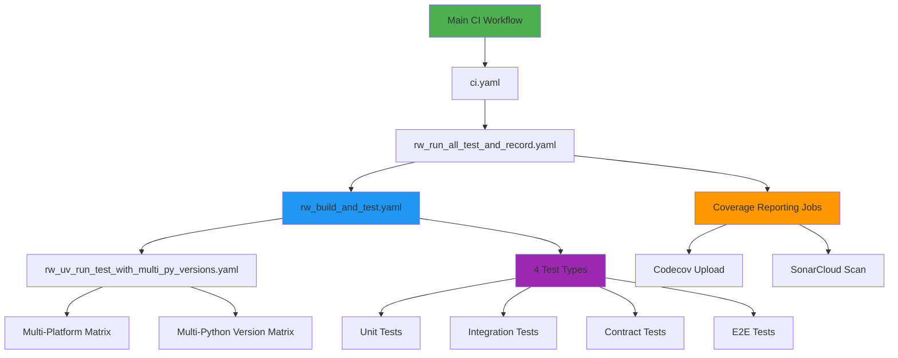

```mdx-code-block
import TOCInline from '@theme/TOCInline';
```

# Continuous Integration


The Python UV template features a **comprehensive, modular CI system** that supports flexible testing configurations, multi-platform compatibility, and extensive test coverage reporting. The architecture is designed for scalability and ease of maintenance.

<TOCInline toc={toc} />

## Status Badges

[](https://github.com/Chisanan232/abstract-backend/actions/workflows/ci.yaml)

The single `ci.yaml` workflow runs the full matrix—**unit, integration, contract, and end-to-end suites**—on every push/PR to `master`. The retired `ci_includes_e2e_test.yaml` scheduler is no longer required because E2E coverage is built into the primary workflow.

## CI Workflow Architecture

The new CI system features a **3-tier modular architecture** that provides maximum flexibility and maintainability:



### Architecture Benefits

✅ **Modular Design**: Clear separation of concerns across workflow layers  
✅ **Flexible Configuration**: Configurable Python versions and operating systems  
✅ **Comprehensive Testing**: 4 different test suites (unit, integration, contract, E2E) with matrix execution  
✅ **Multi-Platform Support**: Ubuntu (latest, 22.04) and macOS (latest, 14)  
✅ **Scalable**: Easy to add new test types or platforms  
✅ **Maintainable**: Single workflow changes affect all consuming workflows

## Workflow Triggers & Configuration

### Main CI Workflow (`ci.yaml`)

**Triggers:**
- **Push to base branch**
- **Pull requests to base branch**
- **Path-based filtering**: Only triggers when relevant files change

**Monitored Paths:**
```yaml
# GitHub Actions workflows
- ".github/workflows/ci.yaml"
- ".github/workflows/rw_build_and_test.yaml"
- ".github/workflows/rw_run_all_test_and_record.yaml"

# Source code and tests
- "<your_package_name>/**/*.py"
- "test/**/*.py"

# Configuration files
- ".coveragerc", "codecov.yml", "pytest.ini"
- "sonar-project.properties"
- "pyproject.toml", "uv.lock"
```

## Detailed Workflow Components

### Tier 1: Main CI Entry Points

#### 1. Regular CI (`ci.yaml`)
```yaml
jobs:
  build-and-test_all:
    uses: ./.github/workflows/rw_run_all_test_and_record.yaml
    secrets:
      codecov_token: ${{ secrets.CODECOV_TOKEN }}
      sonar_token: ${{ secrets.SONAR_TOKEN }}
```
- **Purpose**: Standard development CI without E2E tests
- **Optimized**: Balanced execution time for daily development
- **Coverage**: Unit, integration, contract, and end-to-end tests

### Tier 2: Test Orchestration (`rw_run_all_test_and_record.yaml`)

**Core Functionality:**
- **Coordinates** all testing phases and coverage reporting
- **Manages** dependencies between test execution and reporting
- **Integrates** with external coverage and quality tools

**Key Features:**
```yaml
secrets:
  codecov_token: "Codecov API token"
  sonar_token: "SonarCloud API token"
```

**Workflow Jobs:**
1. **`build-and-test`**: Executes all test suites via `rw_build_and_test.yaml`
2. **Coverage Upload Jobs**: Individual coverage reports for each test type
3. **`sonarcloud_finish`**: Code quality analysis and reporting

### Tier 3: Core Testing Engine (`rw_build_and_test.yaml`)

**Comprehensive Test Suite Execution:**

#### Test Types Supported

| Test Type | Folder | Description | Parallel Execution |
|-----------|---------|-------------|-----------------|
| **Unit Tests** | `./test/unit_test` | Component-level testing | Full matrix |
| **Integration Tests** | `./test/integration_test` | Multi-component testing | Full matrix |
| **Contract Tests** | `./test/contract_test` | API contract validation | Full matrix |
| **End-to-End Tests** | `./test/e2e_test` | Full system scenarios | Sequential (`max-parallel: 1`)

#### Configuration Matrix

**Python Versions (Configurable):**
```yaml
python-versions: '["3.13"]'  # Default, easily configurable
```

**Operating Systems (Multi-Platform):**
```yaml
operating-systems: '[
  "ubuntu-latest", 
  "ubuntu-22.04", 
  "macos-latest", 
  "macos-14"
]'
```

### Tier 4: Multi-Platform Test Execution (`rw_uv_run_test_with_multi_py_versions.yaml`)

**Enhanced Features (New):**
- ✅ **Configurable Python Versions**: JSON array input for flexible Python version testing
- ✅ **Configurable Operating Systems**: JSON array input for multi-platform support
- ✅ **Matrix Strategy**: Full combinatorial testing across Python versions and OS platforms
- ✅ **Dependency Group Support**: UV-based dependency management with group installation
- ✅ **API Integration Testing**: Slack bot token validation for E2E tests

**Configuration Options:**
```yaml
inputs:
  python-versions:
    description: "JSON array of Python versions to test against"
    default: '["3.13"]'
  operating-systems:
    description: "JSON array of operating systems to test on"
    default: '["ubuntu-latest", "ubuntu-22.04", "macos-latest", "macos-14"]'
  test_type: "Specific test type (unit-test, integration-test, etc.)"
  test_folder: "Target test folder path"
  install_dependency_with_group: "UV dependency group for installation"
  max-parallel: "Maximum parallel jobs (default: 0 = unlimited)"
```

## Advanced Configuration

### Python Version Flexibility

**Single Version (Fast CI):**
```yaml
python-versions: '["3.13"]'
```

**Multi-Version (Compatibility Testing):**
```yaml
python-versions: '["3.11", "3.12", "3.13"]'
```

### Operating System Flexibility

**Ubuntu Only (Fast CI):**
```yaml
operating-systems: '["ubuntu-latest"]'
```

**Full Cross-Platform:**
```yaml
operating-systems: '[
  "ubuntu-latest", 
  "ubuntu-22.04", 
  "macos-latest", 
  "macos-14",
  "windows-latest"
]'
```

## Coverage Reporting Integration

### Codecov Integration

**Per-Test-Type Coverage:**
- **Unit Tests**: `codecov_flags: unit-test`
- **Integration Tests**: `codecov_flags: integration-test`
- **Contract Tests**: `codecov_flags: contract-test`
- **End-to-End Tests**: `codecov_flags: e2e-test`
- **All Tests Combined**: `codecov_flags: all-test`

### SonarCloud Integration

**Code Quality Metrics:**
- **Static Analysis**: Code complexity, maintainability
- **Security**: Vulnerability detection and security hotspots
- **Reliability**: Bug detection and code smells
- **Coverage**: Integration with test coverage data

## Best Practices & Usage

### Development Workflow

**Regular Development Workflow:**
1. Create feature branch from base branch (CI excludes branches whose names match `*e2e*`)
2. Push commits trigger `ci.yaml` workflow
3. Full matrix runs, including end-to-end tests, with coverage uploaded to Codecov
4. Code quality checked by SonarCloud

### Configuration for Child Projects

**Step 1: Update Branch Names**
```yaml
# In ci.yaml
branches:
  - "main"  # Change from "<your_base_branch>"
```

**Step 2: Update Package Name**
```yaml
# In ci.yaml paths section
paths:
  - "your_package/**/*.py"  # Change from "<your_package_name>"
```

**Step 3: Configure Secrets**
```yaml
# Repository secrets needed:
CODECOV_TOKEN: "Your Codecov token"
SONAR_TOKEN: "Your SonarCloud token"
```

**Step 4: Customize Test Matrix (Optional)**
```yaml
# In rw_build_and_test.yaml, modify for your needs:
python-versions: '["3.11", "3.12", "3.13"]'  # Add more Python versions
operating-systems: '["ubuntu-latest", "macos-latest"]'  # Reduce OS matrix if needed
```

### Performance Optimization

**Fast CI Strategy:**
- Use single Python version for regular CI
- Limit OS matrix to essential platforms
- Use `max-parallel` settings appropriately

**Comprehensive CI Strategy:**
- Multi-Python version testing for compatibility
- Full OS matrix for cross-platform validation
- Keep E2E tests in the primary workflow while avoiding additional scheduled workflows

### Troubleshooting

**Common Issues:**

1. **Test Matrix Too Large**
   - **Symptom**: CI takes too long or hits GitHub Actions limits
   - **Solution**: Reduce Python versions or OS matrix
   - **Example**: Use `python-versions: '["3.13"]'` and `operating-systems: '["ubuntu-latest"]'`

2. **Coverage Upload Issues**
   - **Symptom**: Codecov upload fails or shows incomplete coverage
   - **Solution**: Verify `CODECOV_TOKEN` secret and check coverage file generation
   - **Debug**: Enable debug logging in coverage upload step

3. **Dependency Installation Failures**
   - **Symptom**: UV dependency installation fails
   - **Solution**: Check `pyproject.toml` dependency groups and UV lock file
   - **Fix**: Ensure dependency group (`dev`) exists and is properly configured

### Migration Guide

**From Legacy CI:**
1. **Replace** old CI workflows with new modular architecture
2. **Update** branch and package name references
3. **Configure** repository secrets for external integrations
4. **Test** the core CI workflow (which already runs end-to-end tests)
5. **Optimize** matrix configuration for your project needs

**Benefits After Migration:**
- ✅ **Faster CI**: Optimized workflow for daily development
- ✅ **More Flexible**: Configurable Python versions and OS platforms
- ✅ **Better Organized**: Clear separation of test types
- ✅ **Comprehensive Coverage**: Four suites (unit, integration, contract, E2E) with detailed reporting
- ✅ **Easier Maintenance**: Modular architecture simplifies updates

---

## Navigation

- **🏠 [CI/CD Overview](./index.mdx)** - Return to main CI/CD hub
- **🔄 [Release System](./release-system.mdx)** - Learn about releases and deployment
- **⚙️ [Additional CI Workflows](./additional-ci-workflows.mdx)** - Specialized utility workflows
- **🛠️ [Developer Guide](./developer-guide.mdx)** - Configuration and troubleshooting
