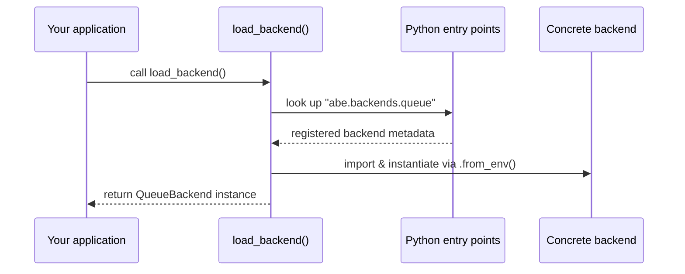

# Abstract Backend

**Abstract Backend** is a pluggable abstraction layer for backend components. It defines shared contracts, runtime helpers, and discovery utilities so that individual backends can be added or removed with nothing more than `pip install` or `pip uninstall`.

Instead of hard-wiring a specific queue, cache, or service implementation into your application, Abstract Backend lets you:

- Keep a stable Python API for your code (`QueueBackend`, `EventConsumer`, etc.).
- Discover concrete implementations from Python entry points.
- Swap implementations at deploy time without changing application code.

## Why a backend abstraction layer?

Building multi-environment systems usually forces developers to pick one message broker or service vendor early, even when the project would benefit from a pluggable architecture. Abstract Backend removes that friction:

- **Hot-swappable backends** – Install a backend provider package (for example `abe-backend-redis`) and Abstract Backend will discover it automatically via the `abe.backends.queue` entry point group.
- **Simple deprecation story** – Removing a backend is as easy as `pip uninstall` or replacing the package with another provider.
- **Strong typing & protocols** – The interfaces in `abe/backends/queue/base/` are Protocol-based so your IDE and static analysis tools know what to expect.
- **Out-of-the-box fallback** – An in-memory `MemoryBackend` lives in `abe/backends/queue/service/memory.py` so you can get started instantly while evaluating production options.

## Core building blocks

| Component | Location | Purpose |
|-----------|----------|---------|
| `QueueBackend` protocol | `abe/backends/queue/base/protocol.py` | Defines the async publish/consume contract that every backend must implement. |
| `EventConsumer` protocol & `AsyncLoopConsumer` | `abe/backends/queue/base/consumer.py`, `abe/backends/queue/consumer.py` | Provides a standard message-consumption loop that works with any backend. |
| Plugin loader | `abe/backends/queue/loader.py` | Discovers implementations via Python entry points and selects the right backend at runtime. |
| Memory backend | `abe/backends/queue/service/memory.py` | Development-friendly backend used when no external provider is installed. |

The combination of protocols, loader, and runtime helpers gives you a consistent interface for publishing and consuming messages across environments.

## How discovery works



1. You install one or more backend provider packages. Each provider registers an entry point under `abe.backends.queue`.
2. Your application calls `load_backend()`.
3. The loader selects the requested provider (via `QUEUE_BACKEND` environment variable) or the first non-memory option.
4. The provider’s `from_env()` factory initializes the backend using deployment-specific settings.

## Developer experience highlights

- **One API, many providers** – Application code targets the `QueueBackend` interface and does not need to know which provider is installed.
- **Pip-based lifecycle** – Install a backend you need, remove the ones you do not. CI/CD pipelines can manage providers with standard Python packaging tooling.
- **Observability hooks** – Logging configuration under `abe/logging/` exposes `LoggingConfig` and helper utilities to standardize log output across backends.
- **Typed surface area** – `abe/types.py` exports shared type aliases, ensuring downstream projects receive full typing metadata thanks to the bundled `py.typed` marker.

## Typical flow for consumers

```python
from abe.backends.queue.loader import load_backend
from abe.backends.queue.consumer import AsyncLoopConsumer

async def handle_message(payload: dict[str, object]) -> None:
    ...  # implement domain logic

backend = load_backend()  # resolves to the installed provider
consumer = AsyncLoopConsumer(backend)

await consumer.run(handle_message)
```

Change the behavior simply by installing a different backend provider package or exporting `QUEUE_BACKEND=my-provider` before the process starts.

## When is Abstract Backend a good fit?

- You support multiple deployment environments that depend on different queue technologies.
- You ship a library that needs to integrate with user-selected infrastructure without baking in a dependency.
- You want to experiment with new providers without rewriting glue code.
- You care about typed interfaces and predictable runtime lifecycle management.

## Next steps

- **Set up your environment** → [Quick Start](./quick-start/index.mdx)
- **Learn about entry-point validation** → [Type Checking with MyPy](../development/type-checking.mdx)
- **Dive into architecture details** → [Architecture Overview](../development/architecture/index.mdx)

Bring your own backend package or build one that implements the protocols. Abstract Backend makes it pleasant to wire everything together.
